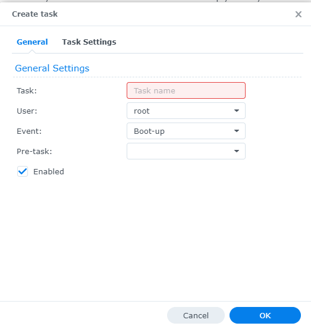
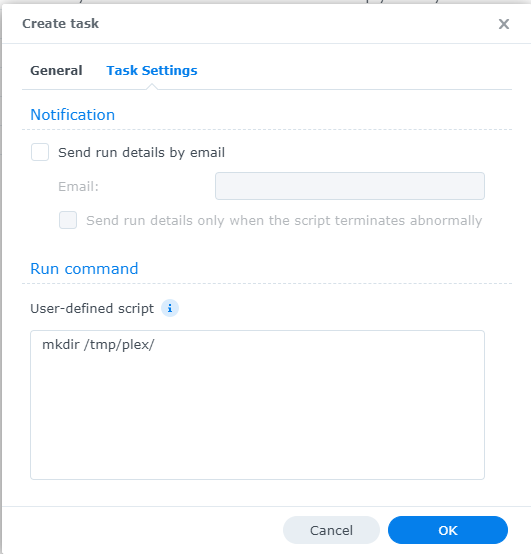

# Synology

!!! note

    Being I don't have a Synology myself and I kind of hate the Synology GUI for the dockers, I'm doing this with the use of docker-compose through a terminal.

    This is faster then the GUI and after installing, it shows up in the Docker GUI.

    Thnx to faxity for the initial compose that I used to create the Synology Guide.

We need to get some information that we need later to setup the docker-compose file.

## SSH

For this guide, we are mostly going to use the terminal. Some parts will need the Syno GUI.
To enable terminal, we need to enable SSH in the Synology Settings.

`Control Panel > Terminal & SNMP > Enable SSH service`


Then use a program like [Putty](https://www.putty.org/){:target="_blank" rel="noopener noreferrer"} and you can SSH into your Synology.

Login if you get a popup asking if you want to trust the key,
Just press `OK` or `ACCEPT`

Enter the login information of your main Synology user account.


## Create a new share

We will use a new share named `data` (lowercase).

Later in this guide, we will fill this share with subfolders.

To create a new share:

`Control Panel > Shared Folder > click Create > choose Create Shared Folder`


Name this shared folder `data`. You can disable the trash can. Click next until you are done.


## PUID and PGID

In order for the Docker container to access the shares on the Synology, we need to know the user ID (PUID) and group ID (PGUID).
For this, we are going to create a new user that only has access to the share(s) that we use for this guide.

Go to `Control Panel > User & Group`

In the `User` section, create a new user. Name it whatever you like, but for this guide we will use `docker`.

Fill out the rest of the information, generate a password or type your own.

Click next, you will now be able to select which group this user will belong to, it should only be `users`. Click next.

In the next screen you will be able to select to which Shares this user will have access to, click `No Access` on the top, this will deny all access.

Now only select Read/Write on the shares `docker` and `data`.

Click next until you reach `Assign application permissions`, deny all. Continue to click next until you are finished.

You have now created a new user. We are going to need this user's PUID/PGID.

Go into your terminal app, login to your synology ssh.


Once logged in type `id $user`. Change $user to the newly created username `docker`.


This will show you the UID (aka PUID).
Which in this screenshot is `1026` for the administrator
and the GID (aka PGID) which is `100` for the users group.
Remember these values for later use.

!!! note

    It is not recommended to use your admin/main user account. That is why we just created a new user.

------


## Folder Structure

!!! attention

    To get Hardlinks and Atomic-Moves working with your Synology you will need to make use of **ONE** share with subfolders.

For this example we're going to make use of the share called `data`.

On the host (Synology) terminal you will need to add `/volume1/` before it. So `/volume1/data`

The `data` folder has sub-folders for `torrents` and `usenet` and each of these have sub-folders for `tv`, `movie` and `music` downloads to keep things neat. The `library` folder has nicely named `tv`, `movies` and `music` sub-folders, this is your library and what you’d pass to Plex, Emby or JellyFin.

These subfolders you need to create your self.

*I'm using lower case on all folder on  purpose, being Linux is case sensitive.*

```none
data
├── torrents
│  ├── movies
│  ├── music
│  └── tv
├── usenet
│  ├── movies
│  ├── music
│  └── tv
└── library
    ├── movies
    ├── music
    └── tv
```

--8<-- "includes/hardlinks/breakdown-folder-structure.md"

------

## Appdata

Your appdata will be stored in `/volume1/docker/appdata/{appname}`
These `{appname}` sub folders you need to create your self. (*This is a limitation of the Synology*)
We're going to do this in Putty or a similar program.

```bash
sudo mkdir /volume1/docker/appdata
cd /volume1/docker/appdata
sudo mkdir radarr sonarr bazarr plex tautulli pullio
# The following is needed for plex transcode location
sudo mkdir /tmp/plex
```

You can add your own sub folders for your download client(s) using this command.

??? bug "plex transcode location `/tmp/plex`  - [CLICK TO EXPAND]"
    The extra created `/tmp/plex` folder for plex's transcode location won't survive a reboot.

    so you will need to create in your task scheduler a "triggered task" that runs on startup of the nas.

    Add the following command as root: `mkdir /tmp/plex/`

    

    

    If you need extra help please come to [](https://trash-guides.info/discord){:target="_blank" rel="noopener noreferrer"}

So your appdata folder will look like this.

```bash
ls -al /volume1/docker/appdata
```

```none
docker
└── appdata
    ├── radarr
    ├── sonarr
    ├── bazarr
    ├── plex
    ├── pullio
    ├── tautulli
    └── (your download client, ie nzbget, sabnzbd, qbittorrent)
```

------

## Needed files

First we will download the `docker-compose.yml` file

Download this [docker-compose.yml](https://github.com/TRaSH-/Guides-Synology-Templates/blob/main/docker-compose/docker-compose.yml){:target="_blank" rel="noopener noreferrer"} to your `/volume1/docker/appdata` location so you got your important stuff together.

```bash
sudo wget https://raw.githubusercontent.com/TRaSH-/Guides-Synology-Templates/main/docker-compose/docker-compose.yml
```

??? question "What's included and What's not included - [CLICK TO EXPAND]"

    This docker-compose file will have the following docker containers included.

    - Radarr
    - Sonarr
    - Bazarr (Subtitle searcher and downloaded)
    - Plex
    - Tautulli

    What's not included.

    I didn't add a downloader to it because it depends on what you prefer usenet/torrents and which client you prefer, so i created a new [Repository](https://github.com/TRaSH-/Guides-Synology-Templates){:target="_blank" rel="noopener noreferrer"} on Github where I provide and maintain some templates that you can find in the `template` folder ready to use with the main `docker-compose.yml`.

    The only thing you need to do is copy/paste what's inside the `.yml` file in to the main `docker-compose.yml`, the template also has the command what you need to use to create the [appdata](#appdata) folder that we explained earlier.

Second we will download the `.env` file

Download this [.env](https://github.com/TRaSH-/Guides-Synology-Templates/blob/main/docker-compose/.env){:target="_blank" rel="noopener noreferrer"} to your `/volume1/docker/appdata` location so you got your important stuff together.

```bash
sudo wget https://raw.githubusercontent.com/TRaSH-/Guides-Synology-Templates/main/docker-compose/.env
```

!!! attention
    :bangbang: MAKE SURE THE FILE KEEPS THE ORIGINAL NAME `.env` WITH THE DOT BEFORE IT  :bangbang:

------

### Changes you need to do

The `.env` we downloaded holds the variables/information you need to change so everything works (I added also a description in the `.env` file)

!!! info ""
    The `.env` holds more variables/information for other containers

1. DOCKERCONFDIR (only change this if you know what you're doing and decide to use another path then in this guide used)
1. DOCKERDATADIR (only change this if you know what you're doing and decide to use another path then in this guide used)
1. PUID/PGID (this info you got earlier from [HERE](#puid-and-pgid))
1. TZ (Change to your timezone)
1. Install and Create a task scheduler for Pullio, so your containers stay up to date.

------

#### Pullio - Auto update docker-compose the correct way

First you need to download Pullio

```bash
   sudo curl -fsSL "https://raw.githubusercontent.com/hotio/pullio/master/pullio.sh" -o /usr/local/bin/pullio
   sudo chmod +x /usr/local/bin/pullio
```

For Pullio you will need to create in your task scheduler a "triggered task" that runs for example at 4am at night with root privileges.

Add the following 2 lines to your triggered task

```bash
   /usr/local/bin/pullio > /volume1/docker/appdata/pullio/pullio.log 2>&1
```

More info about Pullio [HERE](https://hotio.dev/pullio/){:target="_blank" rel="noopener noreferrer"}

------

### Permissions

Now we need to make sure that the newly created files and folders have the correct permissions.

!!! note
    If you're using another user then `admin` then you need to change it in the commands below !!!

```bash
sudo chown -R admin:users /volume1/data /volume1/docker
sudo chmod -R a=,a+rX,u+w,g+w /volume1/data /volume1/docker
```

------

## Run the Docker Compose

!!! important
    make sure you deleted/removed all your existing dockers from the GUI and also remove your native installs of these applications !!!

When you did all the above steps you only need to type the following in your `/volume1/docker/appdata`

```bash
cd /volume1/docker/appdata
sudo docker-compose up -d
```

You will notice that all the images will be downloaded, and after that the containers will be started. If you get a error then look at the error what it says and try to fix it. If you still got issues then put your used docker-compose.yml on [0bin](https://0bin.net/){:target="_blank" rel="noopener noreferrer"} and join the guides-discord [here](https://trash-guides.info/discord){:target="_blank" rel="noopener noreferrer"} and provide the pastebin link with the error, have patience because of timezone differences.

------

**Don't forget to look at the [Examples](/Hardlinks/Examples/) how to setup the paths inside your applications.**

!!! attention

    If you need to do any changes only edit the `docker-compose.yml` file and activate the changes when you type `sudo docker-compose up -d` again.

    Any changes you do/did in the GUI will be reverted when you run the docker-compose.

    Just don't use the GUI !!!

--8<-- "includes/hardlinks/docker-compose-commands.md"
