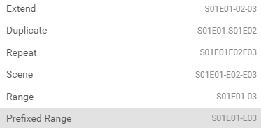

# Recommended naming scheme

Often on the [Sonarr Discord](https://discord.gg/M6BvZn5){:target="_blank" rel="noopener noreferrer"} people ask what's the recommended/best way to
name your files.  First off it's personal preference, but it's often recommended
to add non-recoverable info.

Why?

If, for whatever reason, you ever need to do a re-install or re-import in
Sonarr or Plex/Emby/JellyFin it's nice to have all that info in the filename so
it gets imported correctly and isn't incorrectly matched as HDTV or WEB-DL etc.

The Tokens not available in the release won't be used/shown.

------

## Standard Episode Format

!!! caution "Starting from v3.0.6.1431, Sonarr now supports recognizing Dolby Vision (DV) and High Dynamic Range (HDR) types. "

    If you're using a lower version replace:

    `{[MediaInfo VideoDynamicRangeType]}` with `{[MediaInfo VideoDynamicRange]}`

```bash
{Series TitleYear} - S{season:00}E{episode:00} - {Episode CleanTitle} [{Preferred Words }{Quality Full}]{[MediaInfo VideoDynamicRangeType]}{[Mediainfo AudioCodec}{ Mediainfo AudioChannels]}{MediaInfo AudioLanguages}{[MediaInfo VideoCodec]}{-Release Group}
```

??? summary "RESULTS: - [CLICK TO EXPAND]"

    Single Episode:

    `The Series Title! (2010) - S01E01 - Episode Title 1 [AMZN WEBDL-1080p Proper][DV HDR10][DTS 5.1][x264]-RlsGrp`

    Multi Episode:

    `The Series Title! (2010) - S01E01-E02-E03 - Episode Title [AMZN WEBDL-1080p Proper][DV HDR10][DTS 5.1][x264]-RlsGrp`

------

## Daily Episode Format

```bash
{Series TitleYear} - {Air-Date} - {Episode CleanTitle} [{Preferred Words }{Quality Full}]{[MediaInfo VideoDynamicRangeType]}{[Mediainfo AudioCodec}{ Mediainfo AudioChannels]}{MediaInfo AudioLanguages}{[MediaInfo VideoCodec]}{-Release Group}
```

??? summary "RESULTS: - [CLICK TO EXPAND]"

    `The Series Title! (2010) - 2013-10-30 - Episode Title 1 [AMZN WEBDL-1080p Proper][DV HDR10][DTS 5.1][x264]-RlsGrp`

------

## Anime Episode Format

```bash
{Series TitleYear} - S{season:00}E{episode:00} - {absolute:000} - {Episode CleanTitle} [{Preferred Words }{Quality Full}]{[MediaInfo VideoDynamicRangeType]}[{MediaInfo VideoBitDepth}bit]{[MediaInfo VideoCodec]}[{Mediainfo AudioCodec} { Mediainfo AudioChannels}]{MediaInfo AudioLanguages}{-Release Group}
```

??? summary "RESULTS: - [CLICK TO EXPAND]"

    Single Episode:

    `The Series Title! (2010) - S01E01 - 001 - Episode Title 1 [iNTERNAL HDTV-720p v2][HDR10][10bit][x264][DTS 5.1][JA]-RlsGrp`

    Multi Episode:

    `The Series Title! (2010) - S01E01-E02-E03 - 001-002-003 - Episode Title [iNTERNAL HDTV-720p v2][HDR10][10bit][x264][DTS 5.1][JA]-RlsGrp`

------

### Series Folder Format

```bash
{Series TitleYear}
```

RESULT:

`The Series Title! (2010)`

#### Optional Series Folder Format for the Plex TV Series Scanner and Jellyfin/Emby

This naming scheme is made to be compatible with the New [Plex TV Series Scanner](https://forums.plex.tv/t/beta-new-plex-tv-series-scanner/696242){:target="_blank" rel="noopener noreferrer"} that now support IMDB and TVDB IDs in file names.

For Plex:

```bash
{Series TitleYear} [imdb-{ImdbId}]
```

RESULT:

`The Series Title! (2010) [imdb-tt1520211]`

!!! note
    The officially supported format is `{imdb-{ImdbId}}` but plex should also support `(imdb-{ImdbId})` or `[imdb-{ImdbId}]`, though the above should work for now, It's actually not needed to add a ID to the folder or filename to use the New Plex TV Series Scanner.

For Jellyfin/Emby:

```bash
{Series TitleYear} [imdbid-{ImdbId}]
```

RESULT:

`The Series Title! (2010) [imdbid-tt1520211]`

!!! tip
    IMDb IDs are going to be very accurate and rarely change, TVDB/TMDB IDs, on the other hand, do change or are removed more frequently.

------

### Season Folder Format

For this there's only one real option to use in my opinion.

```bash
Season {season:00}
```

RESULT:

`Season 01`

------

### Multi-Episode Style

```bash
Scene
```

RESULTS:



------

## Original Title vs  Original Filename

Want to keep the original release name that holds like all the info of the file then I suggest to use `{Original Title}` over  `{Original Filename}`

Why?

The filename can be Obscured where the Release naming isn't especially when you use Usenet.

`{Original Title}` => `The.Series.Title.S01E01.Episode.Title.1080p.AMZN.WEB-DL.DDP5.1.H.264-RlsGrp`

`{Original Filename}` => `show episode 1-1080p` or `lchd-tkk1080p` or `t1i0p3s7i8yuti`

------

Thanks:

A big Thanks to [fryfrog](https://github.com/fryfrog), [rg9400](https://github.com/rg9400) and [bakerboy448](https://github.com/bakerboy448) for the suggestions.

--8<-- "includes/support.md"
